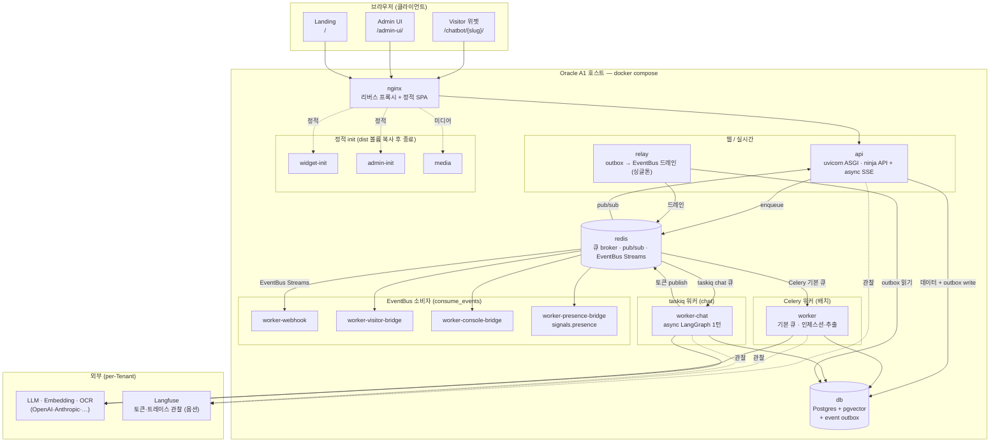
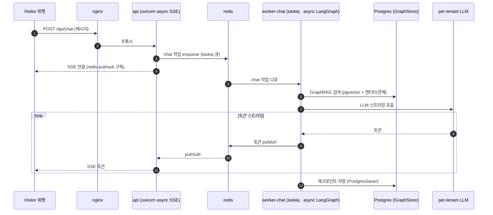
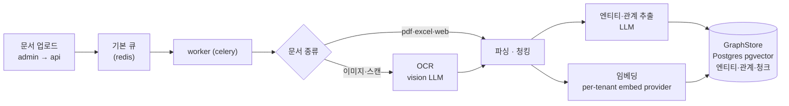
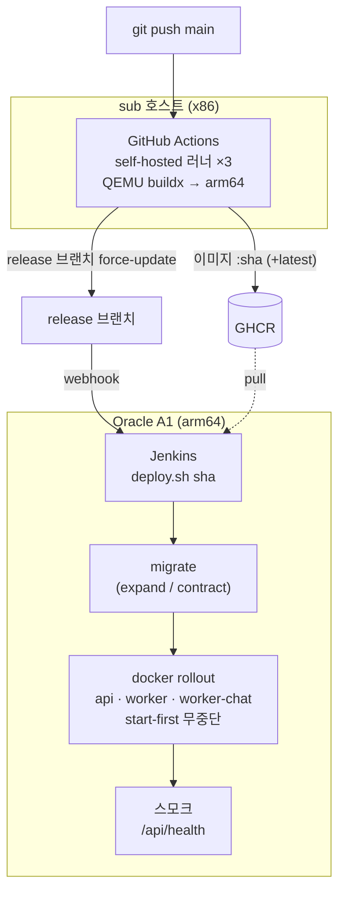

# 아키텍처

embed-chat(멀티테넌트 GraphRAG 챗봇)을 4개 관점으로 본다. GitHub·VSCode가 아래 mermaid를
렌더링한다. 배포 런북은 [deployment.md](./deployment.md), 설계 근거는 [docs/adr/](./adr/) 참조.

## 1. 런타임 컴포넌트 토폴로지

prod(Oracle A1) 서비스 전부와 통신 경로. 모든 backend 서비스는 같은 `embed-chat-api` 이미지를
다른 command로 띄운다.

## 2. 챗 요청 흐름 (시퀀스)

방문자 메시지가 SSE로 스트리밍 응답되기까지. chat 1턴은 api 프로세스가 아니라 전용 taskiq
`worker-chat`에서 async로 실행되어 블로킹이 SSE 서빙을 얼리지 않는다.

## 3. 인제스션 · RAG 데이터 파이프라인

문서가 지식그래프가 되기까지. 인제스션은 멱등(결정적 ID + upsert)이라 재배달에 안전하다.

## 4. 배포 파이프라인 (CI/CD)

빌드(sub)와 런타임(A1)을 완전 분리 — A1은 pull만, 빌드는 절대 안 한다. 자세한 무중단 메커니즘은
[deployment.md](./deployment.md), 설계는 [ADR-0015](./adr/0015-oracle-zero-downtime-rolling-deploy.md).

